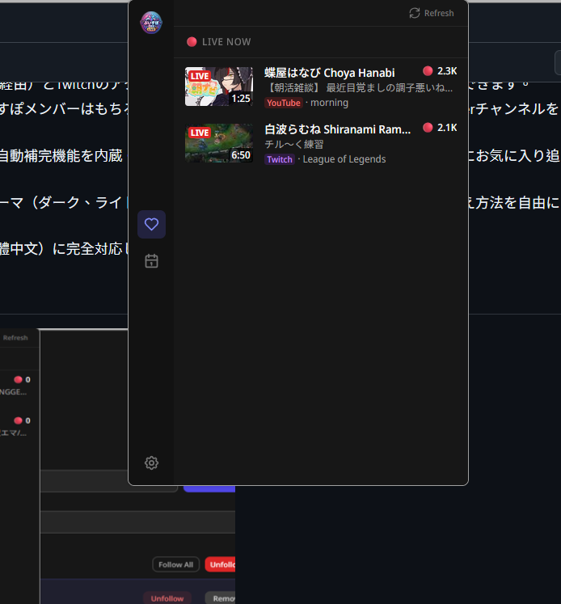
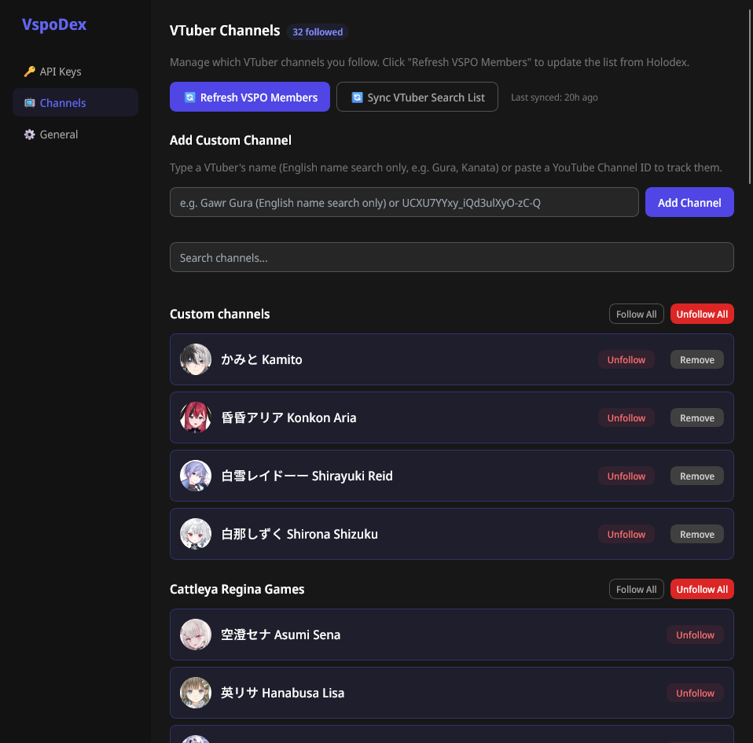

# VspoDex 🎮

輕鬆追蹤 **ぶいすぽっ！ (VSpo)** VTuber 的直播。VspoDex 是一款結合了 Holodex 與 Twitch 數據的瀏覽器擴充功能，讓您即時掌握喜愛成員的最新動態。

[English](README.md) | 繁體中文 | [日本語](README.ja.md)

## 🚀 關於本專案
本擴充功能專為 VSpo 社群打造。它提供了一個乾淨且高效的介面，讓您跨平台（透過 Holodex API 的 YouTube 以及 Twitch）監控直播、即將播放的節目表以及頻道資訊。

> [!IMPORTANT]
> 本擴充功能需要設定 Holodex API 金鑰才能正常運作。設定非常簡單——只需按照擴充功能設定頁面中的步驟指示操作即可。

## ⚙️ 功能特色

- **【新功能】自動開啟最愛頻道**：點擊彈出式視窗側邊欄底部的閃電按鈕，即可在最愛的 VTuber 開播時自動開啟新分頁（支援前景/背景分頁設定，以及下播後自動重新啟用/跳轉的實驗性功能）。
- **【新功能】預約直播追蹤**：點擊即將直播卡片上的鬧鐘按鈕，即可在直播開始時（或預定時間）自動開啟該直播分頁。
- **【新功能】成員主題**：提供 15 位成員的專屬顏色主題，設計靈感取自於官方 VSPO! GEAR 機械鍵盤配色（支援淺色/深色模式與角落圓點裝飾）。
- **【新功能】分頁排序**：可在設定頁面中透過拖放操作，自訂調整彈出式視窗側邊欄分頁（直播中、成員、預定、存檔）的順序。
- **【新功能】成員分頁**：將追蹤的頻道分組顯示（包括最愛、VSPO JP、VSPO EN、VSPO 官方），並依訂閱者數量排序。點擊成員即可查看其直播存檔。
- **統一的直播追蹤**：同時監控 YouTube（透過 Holodex API）與 Twitch 的直播和預定節目。
- **自訂追蹤頻道**：追蹤預設的 VSpo 成員，或透過 YouTube 頻道 ID 新增任何自訂的 VTuber 頻道。
- **Hololive & Nijisanji 搜尋**：內建搜尋與自動完成功能，讓您輕鬆搜尋並追蹤 Hololive 及 Nijisanji 的成員。
- **支援直播存檔**：支援無限捲動與時長標記，提供 YouTube 完播影片列表與聯動直播篩選，並支援 Twitch 直播存檔（實驗性功能，預設啟用）顯示。
- **美化與自訂**：可選擇介面主題（深色、淺色、跟隨系統）、調整字型大小以及變更排序選項。
- **多語言支援**：完整支援英文、日文（日本語）及繁體中文。

## 預覽

## 🌐 語言支援
VspoDex 已完整在地化並支援多種語言。您可以在設定頁面的「外觀」區塊下更改偏好的語言：
- 🇺🇸 **English** (預設)
- 🇯🇵 **日本語** (日文)
- 🇹🇼 **繁體中文** (繁體中文)

## 🔑 系統需求
為了確保 VspoDex 正常運作，您需要：
- **Holodex API 金鑰**：需要一組免費的金鑰來從 YouTube 獲取直播數據。
- **Twitch 登入**：您需要在擴充功能中登入 Twitch。這僅用於存取 API 以檢查直播狀態；**本擴充功能不會收集或儲存任何個人資訊或帳戶資料。**

## ✨ 致謝與靈感來源
特別感謝並致敬由 **seldszar** 開發的 [Gumbo](https://github.com/seldszar/gumbo)。Gumbo 的 Twitch 和 Holodex 整合架構是本專案的重要靈感來源。

> [!TIP]
> 這是一個 **vibe coding** 專案！🌊 我使用 AI 來規劃和建構專案架構，並從 Gumbo 優秀的程式碼庫中汲取靈感與設計模式。非常感謝 AI 以及開源社群！

## 🛠️ 如何取得 Holodex API 金鑰
取得 API 金鑰非常快速且完全免費：
1.  前往 [holodex.net](https://holodex.net) 並登入您的帳號。
2.  點擊右上角的個人頭像，然後選擇 **Account Settings** (帳戶設定)。
3.  向下捲動至 **API Key** 區塊。
4.  點擊 **取得新API金鑰** 按鈕以產生您的金鑰。
5.  複製產生的金鑰，並將其貼入 **VspoDex 設定** 頁面中。

---
*由 ❤️ 專為 VSpo 粉絲製作。*
